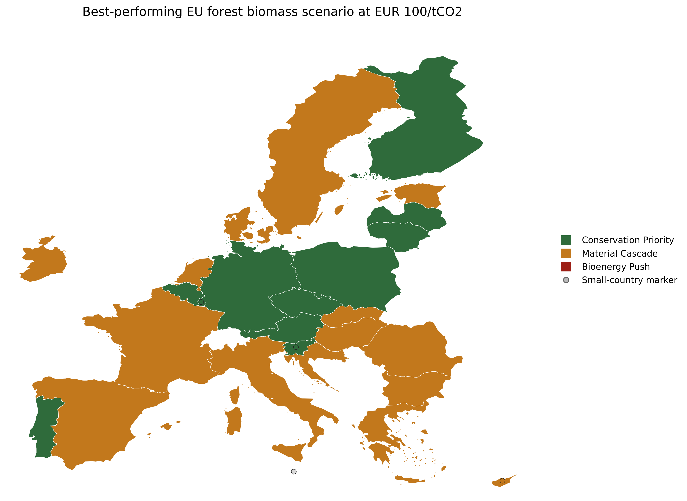

# EU Forest Biomass Trade-off Explorer

> A reproducible research project on EU forest biomass allocation, carbon trade-offs, and regional land-use screening.

This repository examines how alternative forest biomass allocation strategies across EU countries affect forest carbon retention, harvested biomass use, and policy-relevant climate value. The project combines country-level scenario analysis with sensitivity testing, NUTS-2 regional screening, an integrated forest-versus-food policy layer, and a Sweden empirical sub-study based on official subnational forest inventory data.

The repository is designed as a transparent research-style prototype. It aims to make assumptions, data sources, and trade-offs explicit, while remaining reproducible and interpretable for academic and policy-oriented use.



## Research Question

How do different forest biomass allocation strategies across EU countries change the balance between forest carbon retention, harvested biomass use, and climate value, and where do forest-oriented options begin to conflict with agricultural land that is important for food and feed?

## At a Glance

| Dimension | Summary |
| --- | --- |
| Spatial scope | EU-27 country analysis with NUTS-2 regional extensions |
| Baseline year | Latest year shared across the official datasets used in the pipeline (`2024`) |
| Core comparison | `Conservation Priority`, `Material Cascade`, `Bioenergy Push` |
| Data basis | FAOSTAT, Eurostat GISCO, Eurostat regional land and crop statistics, Swedish SLU forest inventory tables |
| Robustness layer | Fixed-seed sensitivity analysis over `400` parameter draws |
| Regional extensions | NUTS-2 forest screening, integrated forest-versus-food screen, constrained portfolio optimization, Sweden empirical rerun |

## Scenario Design

The project compares three stylized policy-relevant alternatives:

| Scenario | Interpretation | Core change |
| --- | --- | --- |
| `Conservation Priority` | Reduce harvest pressure and protect forest carbon | Total harvest reduced by `15%`, with reductions drawn from wood fuel first |
| `Material Cascade` | Shift existing harvest toward higher-value material use | Total harvest unchanged, but `20%` of wood fuel is reallocated to industrial roundwood uses |
| `Bioenergy Push` | Expand direct biomass energy use | Total harvest increased by `15%`, with additional harvest directed to energy use |

## Project Contributions

- Builds a country-level EU forest biomass trade-off model from official forestry and land-use statistics.
- Links forest carbon retention, biomass allocation, and simplified climate-value accounting in one transparent framework.
- Adds a fixed-seed sensitivity layer to distinguish stable recommendations from assumption-sensitive ones.
- Extends the country model to NUTS-2 screening using official Eurostat regional data.
- Introduces an integrated forest-versus-food policy comparison informed by observed land cover and crop-production intensity.
- Solves a constrained regional policy portfolio problem under biomass-supply and crop-capacity safeguards.
- Replaces simple woodland-share downscaling for Sweden with an empirical sub-study based on official county-level forest area, biomass, and increment data.

## Headline Findings

With the default parameterization at `EUR 100/tCO2`:

- `Material Cascade` yields the strongest EU-wide climate benefit relative to baseline at about `18.4 MtCO2e`.
- `Conservation Priority` is close behind at about `17.1 MtCO2e`.
- `Bioenergy Push` is strongly negative at about `-21.8 MtCO2e`.
- `Material Cascade` is the best-performing scenario in `15` EU countries.
- `Conservation Priority` is the best-performing scenario in `12` EU countries.

The robustness layer shows that:

- `Material Cascade` is the best EU-wide scenario in about `56%` of parameter draws.
- `Conservation Priority` is best EU-wide in about `44%` of draws.
- `Bioenergy Push` never becomes the best EU-wide scenario in the sensitivity runs.

The regional layers show that:

- the integrated NUTS-2 screen selects `Food-Land Safeguard` in `40` regions once agricultural competition is made explicit,
- the constrained regional portfolio retains about `97.0%` of baseline regionalized biomass supply while safeguarding about `45.6%` of available crop-capacity proxy,
- the optimized portfolio value is about `EUR 2.15 billion`,
- the Sweden empirical rerun selects `Material Cascade` in all `8` Swedish NUTS-2 regions under the default parameterization.

## Data Sources

The pipeline uses official spatial and statistical data, including:

- FAOSTAT land-use bulk data for forest area, living biomass carbon stock, naturally regenerating forest area, planted forest area, and primary forest area.
- FAOSTAT forestry bulk data for roundwood, industrial roundwood, wood fuel, sawnwood, and wood pellet production.
- Eurostat GISCO country polygons for EU-27 mapping.
- Eurostat GISCO NUTS-2 polygons for regional screening.
- Eurostat `lan_lcv_ovw` regional land-cover statistics.
- Eurostat `apro_cpsh1` crop area, production, and yield statistics used to derive a food-production-intensity profile.
- Swedish University of Agricultural Sciences (SLU) PxWeb tables for county-level productive forest area, dry biomass, and annual increment.

Raw source files are downloaded into `data/raw/` by the pipeline when needed.

## Method Overview

Baseline indicators are derived from observed data for the latest shared year across the official datasets. These include forest area, forest carbon stock, harvest intensity, wood fuel share, material recovery, and a biodiversity-pressure proxy.

Scenario results are evaluated using three simplified climate-accounting components:

- `forest carbon retention`
- `substitution gain`
- `supply-chain savings`

The model uses country-specific forest carbon opportunity-cost factors so that scenario effects remain tied to observed forest conditions rather than a single EU-wide coefficient.

The repository includes four linked regional extensions:

1. A NUTS-2 forest screening layer based on official regional woodland context.
2. An integrated forest-versus-food screen comparing forest strategies with a `Food-Land Safeguard` option.
3. A constrained regional portfolio optimization under biomass-supply and crop-capacity safeguards.
4. A Sweden empirical sub-study using official county-level forest area, biomass, and increment aggregated to Swedish NUTS-2 regions.

Method details, assumptions, and limitations are documented in:

- [`docs/methods_note.md`](docs/methods_note.md)
- [`docs/assumptions.md`](docs/assumptions.md)
- [`docs/limitations.md`](docs/limitations.md)

## Selected Outputs

The repository includes figures and tables that summarize the main analytical layers.

Selected figures:

- [`figures/best_scenario_map.png`](figures/best_scenario_map.png)
- [`figures/eu_scenario_decomposition.png`](figures/eu_scenario_decomposition.png)
- [`figures/country_tradeoff_scatter.png`](figures/country_tradeoff_scatter.png)
- [`figures/eu_uncertainty_ranges.png`](figures/eu_uncertainty_ranges.png)
- [`figures/nuts2_integrated_policy_map.png`](figures/nuts2_integrated_policy_map.png)
- [`figures/nuts2_optimized_policy_map.png`](figures/nuts2_optimized_policy_map.png)
- [`figures/sweden_nuts2_empirical_best_scenario_map.png`](figures/sweden_nuts2_empirical_best_scenario_map.png)

Selected tabular outputs:

- [`outputs/scenario_results_by_country.csv`](outputs/scenario_results_by_country.csv)
- [`outputs/scenario_summary_eu.csv`](outputs/scenario_summary_eu.csv)
- [`outputs/country_ranking_table.csv`](outputs/country_ranking_table.csv)
- [`outputs/sensitivity_country_modal_scenario.csv`](outputs/sensitivity_country_modal_scenario.csv)
- [`outputs/nuts2_integrated_policy_priorities.csv`](outputs/nuts2_integrated_policy_priorities.csv)
- [`outputs/nuts2_optimized_policy_portfolio.csv`](outputs/nuts2_optimized_policy_portfolio.csv)
- [`outputs/sweden_nuts2_empirical_scenario_results.csv`](outputs/sweden_nuts2_empirical_scenario_results.csv)
- [`outputs/run_manifest.json`](outputs/run_manifest.json)

## Reproducibility

Create a virtual environment, install the package, run the pipeline, and execute the tests:

```bash
python3 -m venv .venv
. .venv/bin/activate
python -m pip install -e .
PYTHONPATH=src python -m eu_forest_biomass_tradeoff_explorer.pipeline
pytest
```

The pipeline downloads missing raw data automatically and rebuilds processed data, figures, and output tables. It also writes a machine-readable run manifest to `outputs/`.

## Repository Structure

```text
eu-forest-biomass-tradeoff-explorer/
  README.md
  pyproject.toml
  data/
    raw/
    processed/
  docs/
    assumptions.md
    limitations.md
    methods_note.md
    short_research_report.md
  figures/
  notebooks/
  outputs/
  src/
    eu_forest_biomass_tradeoff_explorer/
  tests/
```

## Limitations

- The core forest scenario model operates at country level rather than stand level or full regional production-model resolution.
- Most NUTS-2 layers remain screening extensions, although the Sweden case replaces simple downscaling with official subnational forest data.
- Carbon accounting is deliberately simplified and uses transparent proxy coefficients for substitution and supply-chain effects.
- Forest carbon dynamics are represented as an opportunity-cost framing rather than a dynamic age-class forest model.
- Biodiversity is represented by a pressure proxy rather than ecological survey or habitat-model outputs.
- The food-land safeguard improves agricultural representation but is not a full regional agricultural emissions model.
- The constrained portfolio is a transparent linear screening model, not a calibrated sector-coupling or market-equilibrium model.

## Further Documentation

- [`docs/REPRODUCIBILITY.md`](docs/REPRODUCIBILITY.md)
- [`docs/DATA_PROVENANCE.md`](docs/DATA_PROVENANCE.md)
- [`docs/RESULTS_VALIDATION.md`](docs/RESULTS_VALIDATION.md)
- [`docs/parameter_grounding_note.md`](docs/parameter_grounding_note.md)
- [`docs/short_research_report.md`](docs/short_research_report.md)
